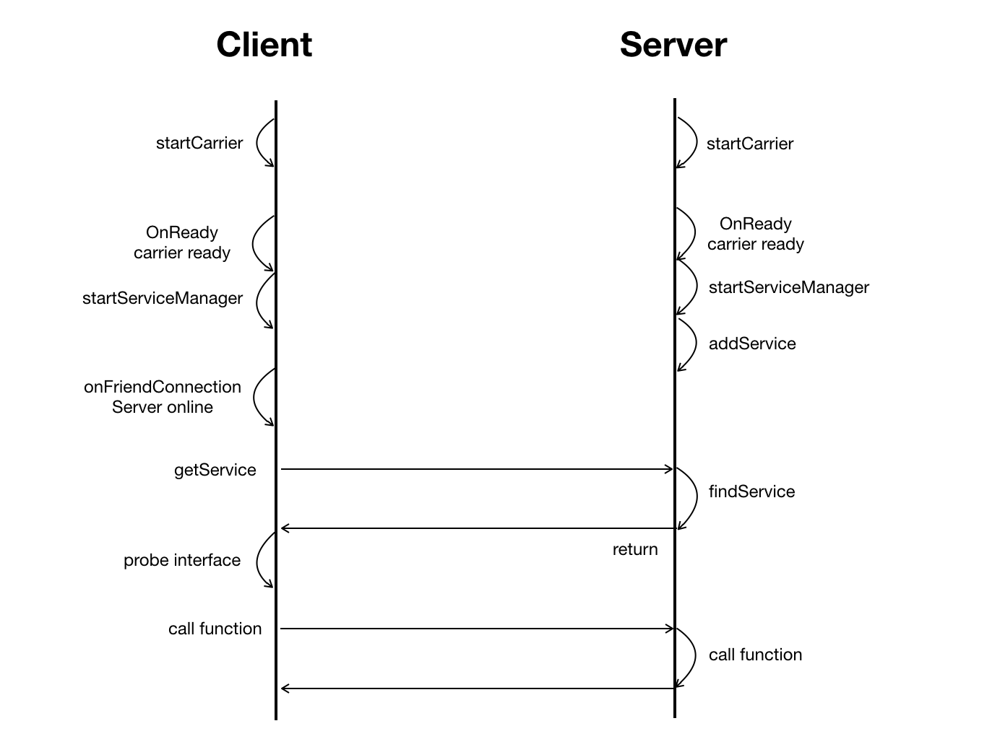

# Elastos RPC Programming

> ## 1.RPC简介

    远程调用（Remote Procedure Call）是一个计算机通信协议。该协议允许运行于一台计算机的程序调用另一台计算机的子程序，而程序员无需额外的为这个交互作用编程。

    Elastos的RPC基于CAR元数据和Carrier实现，两个计算机之间直接进行点对点通信。Carrier的P2P通信是有身份的，双方必须互为好友才可以发送消息，保证调用者和被调用者都能确认身份。

    目前RPC只支持arm 32位。

> ## 2.操作步骤

    首先实现一个car构件，以Sample/RPC/Switch中的开关示例为例。
    rpc时序图：


    如何编写car构件请参考：
[Car Programming](How_To_Write_A_Car_Component)

> ### 2.1.实现Switch

    定义接口

``` cpp
module {
    importlib("Elastos.CoreLibrary");

    interface ISwitchListener {
        OnSwitch1Changed(
            [in] Boolean on);

        OnSwitch2Changed(
            [in] Boolean on);
    }

    interface ISwitch {
        TurnSwitch1(
            [in] Boolean on);

        GetSwitch1(
            [out] Boolean* on);

        TurnSwitch2(
            [in] Boolean on);

        GetSwitch2(
            [out] Boolean* on);

        SetSwitchListener(
            [in] ISwitchListener* listener);

    }

    class CSwitch {
        constructor();

        interface ISwitch;
    }

}
```

    在cpp中添加实现

``` cpp
#include "CSwitch.h"

CAR_OBJECT_IMPL(CSwitch)

CAR_INTERFACE_IMPL(CSwitch, Object, ISwitch);

ECode CSwitch::TurnSwitch1(
    /* [in] */ Boolean on)
{
    if (on != mSwitch1) {
        mSwitch1 = on;
        if (mListener) {
            mListener->OnSwitch1Changed(on);
        }
    }
    return NOERROR;
}

ECode CSwitch::GetSwitch1(
    /* [out] */ Boolean * pOn)
{
    if (!pOn) {
        return E_INVALID_ARGUMENT;
    }
    *pOn = mSwitch1;
    return NOERROR;
}

ECode CSwitch::TurnSwitch2(
    /* [in] */ Boolean on)
{
    if (on != mSwitch2) {
        mSwitch2 = on;
        if (mListener) {
            mListener->OnSwitch2Changed(on);
        }
    }

    return NOERROR;
}

ECode CSwitch::GetSwitch2(
    /* [out] */ Boolean * pOn)
{
    if (!pOn) {
        return E_INVALID_ARGUMENT;
    }
    *pOn = mSwitch2;
    return NOERROR;
}

ECode CSwitch::SetSwitchListener(
    /* [in] */ ISwitchListener * pListener)
{
    if (mListener) {
        mListener->Release();
    }
    mListener = pListener;
    if (mListener) {
        mListener->AddRef();
    }
    return NOERROR;
}

ECode CSwitch::constructor()
{
    return NOERROR;
}
```

    在CMakeLists.txt中增加如下内容，自动导出头文件

``` cpp
xdk_export_car_headers(export_headers ${CURRENT_MIRROR_HEADERS})
xdk_compile_car(CAR_GENERATED_SOURCES Switch.car ${export_headers})
```

> ### 2.2.编译

    编译请参考
[Gettting Start](getting_started)

    选择 5） arm_android_32 (use clang)

    编译完成之后，执行dropsdk，导出头文件和so到Elastos.RT/sdk

> ### 2.3.在android应用中调用

    首先创建两个带jni的android工程，一个Client，一个Server。
    将导出的头文件和so放到cpp目录中，并在做好相应的编译打包设置。

> #### 2.3.1.添加好友

    添加好友过程Client与Server相同。

    首先必须在JNI_OnLoad中调用carrier的初始化方法。

``` cpp
#include <ela_session.h>

JNIEXPORT jint JNICALL JNI_OnLoad(JavaVM* vm, void* reserved){
    ela_session_jni_onload(vm, reserved);
    return JNI_VERSION_1_6;
}
```

    实现Carrier的Listener，自身状态变化和好友状态变化时的回调。在这里可以通知到java，更新页面。

``` cpp
#include "CCarrierListener.h"
#include <Elastos.CoreLibrary.h>
#include "android/log.h"


CAR_INTERFACE_IMPL(CCarrierListener, Object, ICarrierListener)

_ELASTOS ECode CCarrierListener::OnConnectionChanged(
    /* [in] */ _ELASTOS Boolean online)
{
    JNIEnv* env = GetEnv();

    jclass clazz = env->GetObjectClass(mObj);
    jmethodID method = env->GetMethodID(clazz, "OnConnectionChanged", "(Z)V");
    env->CallVoidMethod(mObj, method, online);
    Detach();

    return NOERROR;
}

_ELASTOS ECode CCarrierListener::OnReady()
{
    return NOERROR;
}

_ELASTOS ECode CCarrierListener::OnFriendRequest(
    /* [in] */ const _ELASTOS String& uid,
    /* [in] */ const _ELASTOS String& hello)
{
    JNIEnv* env = GetEnv();

    jstring juid = env->NewStringUTF(uid.string());
    jstring jhello = env->NewStringUTF(hello.string());
    jclass clazz = env->GetObjectClass(mObj);
    jmethodID method = env->GetMethodID(clazz, "OnFriendRequest", "(Ljava/lang/String;Ljava/lang/String;)V");
    env->CallVoidMethod(mObj, method, juid, jhello);
    Detach();

    return NOERROR;
}

_ELASTOS ECode CCarrierListener::OnFriendConnetionChanged(
    /* [in] */ const _ELASTOS String& uid,
    /* [in] */ _ELASTOS Boolean online)
{
    JNIEnv* env = GetEnv();

    jclass clazz = env->GetObjectClass(mObj);
    jmethodID method = env->GetMethodID(clazz, "OnFriendConnectionChanged", "(Ljava/lang/String;Z)V");
    env->CallVoidMethod(mObj, method, env->NewStringUTF(uid.string()), online);
    Detach();

    return NOERROR;
}

JNIEnv* CCarrierListener::GetEnv()
{
    JNIEnv* env;
    assert(mVm != NULL);
    mVm->AttachCurrentThread(&env, NULL);
    return env;
}

void CCarrierListener::Detach()
{
    assert(mVm != NULL);
    mVm->DetachCurrentThread();
}

```

``` h
#ifndef RPCDEMO_CCARRIERLISTENER_H
#define RPCDEMO_CCARRIERLISTENER_H

#include <elastos/core/Object.h>
#include <jni.h>
#include "_ElastosCore.h"
#include "elatypes.h"


class CCarrierListener
        : public Object
        , public ICarrierListener
{
public:

    CAR_INTERFACE_DECL()

    CCarrierListener(
            JNIEnv *env,
            jobject jobj)
    {
        env->GetJavaVM(&mVm);
        mObj = env->NewGlobalRef(jobj);
    }

    virtual ~CCarrierListener()
    {
        GetEnv()->DeleteGlobalRef(mObj);
    }

    CARAPI OnConnectionChanged(
            /* [in] */ _ELASTOS Boolean online);

    CARAPI OnReady();

    CARAPI OnFriendRequest(
            /* [in] */ const _ELASTOS String& uid,
            /* [in] */ const _ELASTOS String& hello);

    CARAPI OnFriendConnetionChanged(
            /* [in] */ const _ELASTOS String& uid,
            /* [in] */ _ELASTOS Boolean online);

private:
    JNIEnv* GetEnv();

    void Detach();

private:
    JavaVM* mVm;
    jobject mObj;
};

#endif //RPCDEMO_CCARRIERLISTENER_H
```

    增加如下的native方法，实现添加好友的过程：

``` cpp

#include "elastos.h"
#include "elapi.h"
#include "ElastosCore.h"
#include "CCarrierListener.h"
#include "elastos/utility/etl/HashMap.h"

ICarrier* gCarrier = NULL;
IServiceManager* gServiceManager = NULL;

extern "C" JNIEXPORT void JNICALL Java_com_elastos_rpcserver_MainActivity_startCarrier(
        JNIEnv *env,
        jobject jobj,
        jstring path) {

        ECode ec = (ECode) _CCarrier_GetInstance(&gCarrier);
        if (FAILED(ec)) return;

        CCarrierListener* listener = new CCarrierListener(env, jobj);
        gCarrier->AddCarrierNodeListener(ICarrierListener::Probe(listener));

        const char* nativeString = env->GetStringUTFChars(path, nullptr);
        gCarrier->Start(String(nativeString));
        env->ReleaseStringUTFChars(path, nativeString);
}

extern "C" JNIEXPORT void JNICALL Java_com_elastos_rpcserver_MainActivity_stopCarrier(
        JNIEnv *env,
        jobject jobj) {
    if (gCarrier == NULL) return;

    gCarrier->Stop();
    gCarrier->Release();
    gCarrier = NULL;
}

extern "C" JNIEXPORT jint JNICALL Java_com_elastos_rpcserver_MainActivity_addFriend(
        JNIEnv *env,
        jobject jobj,
        jstring uid) {
    if (gCarrier == NULL) return -1;

    const char* nativeString = env->GetStringUTFChars(uid, nullptr);
    ECode ec = gCarrier->AddFriend(String(nativeString), String("hello"));
    env->ReleaseStringUTFChars(uid, nativeString);
    return ec;
}

extern "C" JNIEXPORT jint JNICALL Java_com_elastos_rpcserver_MainActivity_deleteFriend(
        JNIEnv *env,
        jobject jobj,
        jstring uid) {
    if (gCarrier == NULL) return -1;

    const char* nativeString = env->GetStringUTFChars(uid, nullptr);
    IFriend* pFriend;
    ECode ec = gCarrier->GetFriend(String(nativeString), &pFriend);
    if (FAILED(ec)) {
        env->ReleaseStringUTFChars(uid, nativeString);
        return ec;
    }

    ec = gCarrier->RemoveFriend(pFriend);
    pFriend->Release();
    env->ReleaseStringUTFChars(uid, nativeString);
    return ec;
}

extern "C" JNIEXPORT jobject JNICALL Java_com_elastos_rpcserver_MainActivity_getFriendList(
        JNIEnv *env,
        jobject jobj) {
    if (gCarrier == NULL) return NULL;

    ArrayOf<IFriend*>* friends = NULL;
    ECode ec = gCarrier->GetFriends(&friends);
    if (FAILED(ec) || friends == NULL) return NULL;

    jclass cls_ArrayList = env->FindClass("java/util/ArrayList");
    jmethodID construct = env->GetMethodID(cls_ArrayList, "<init>", "()V");
    jobject obj_ArrayList = env->NewObject(cls_ArrayList, construct,"");
    jmethodID arrayList_add = env->GetMethodID(cls_ArrayList, "add", "(Ljava/lang/Object;)Z");

    jclass cls_friend = env->FindClass("Friend");
    //none argument construct function
    jmethodID construct_user = env->GetMethodID(cls_friend, "<init>", "(Ljava/lang/String;Z)V");

    for (int i = 0; i < friends->GetLength(); i++) {
        IFriend* iFriend = (*friends)[i];

        String uid;
        iFriend->GetUid(&uid);
        Boolean online;
        iFriend->IsOnline(&online);
        jobject obj_friend = env->NewObject(cls_friend, construct_user, env->NewStringUTF(uid.string()), online);
        env->CallObjectMethod(obj_ArrayList, arrayList_add, obj_friend);
    }

    friends->Release();

    return obj_ArrayList;
}


extern "C" JNIEXPORT jint JNICALL Java_com_elastos_rpcserver_MainActivity_acceptFriend(
        JNIEnv *env,
        jobject jobj,
        jstring uid) {
    if (gCarrier == NULL) return -1;

    const char* nativeString = env->GetStringUTFChars(uid, nullptr);
    ECode ec = gCarrier->AccpetFriendRequest(String(nativeString));
    env->ReleaseStringUTFChars(uid, nativeString);
    return ec;
}

extern "C" JNIEXPORT jstring JNICALL Java_com_elastos_rpcserver_MainActivity_getAddress(
        JNIEnv *env,
        jobject jobj) {
    if (gCarrier == NULL) return env->NewStringUTF("");

    String address;
    gCarrier->GetAddress(&address);
    return env->NewStringUTF(address.string());
}
```

    应用启动之后调用startCarrier启动Carrier，在这里会注册CCarrierListener。获得对方address之后，调用addFriend传入address添加好友，被添加方会收到OnFriendRequest回调，调用accept接受互为好友。

    示例代码中根据address生成二维码，通过扫描二维码添加好友。

    添加好友成功之后，好友上线下线都会在OnFriendConnetionChanged回调中通知。

> #### 2.3.2.注册服务（Server）

    Server端上线之后就可以注册服务，只有注册过的服务才可以被远程查找到。

    Carrier上线之后调用startServiceManager来启动ServiceManager。调用成功之后即可以调用addService来注册服务。
    示例代码中注册了switch这个服务。

    添加如下native方法，实现注册服务：

``` cpp
#include "Swtich.h"

extern "C" JNIEXPORT void JNICALL Java_com_elastos_rpcserver_MainActivity_startServiceManager(
        JNIEnv *env,
        jobject jobj) {
    if (gCarrier == NULL) return;
    if (gServiceManager != NULL) {
        return;
    }

    _CServiceManager_AcquireInstance(&gServiceManager);
}

extern "C" JNIEXPORT void JNICALL Java_com_elastos_rpcserver_MainActivity_stopServiceManager(
        JNIEnv *env,
        jobject jobj) {
    if (gServiceManager) {
        gServiceManager->Release();
        gServiceManager = NULL;
    }
}

extern "C" JNIEXPORT jint JNICALL Java_com_elastos_rpcserver_MainActivity_addService(
        JNIEnv *env,
        jobject jobj,
        jstring name) {
    if (gServiceManager == NULL) {
        return -1;
    }

    ISwitch* pSwitch;
    ECode ec = CSwitch::New(&pSwitch);
    if (FAILED(ec)) return ec;

    CSwitchListener* listener = new CSwitchListener(env, jobj);
    pSwitch->SetSwitchListener(ISwitchListener::Probe(listener));

    const char* nativeString = env->GetStringUTFChars(name, nullptr);
    ec = gServiceManager->AddService(String(nativeString), pSwitch);
    env->ReleaseStringUTFChars(name, nativeString);
    pSwitch->Release();
    return ec;
}
```

> #### 2.3.3.获得服务并调用（Client）

    Client端在Carrier上线之后调用startServiceManager来启动ServiceManager。Server端上线之后，调用getService向Server获取服务，拿到接口，就可以像调用本地接口方法一样调用远端。getService传入的name必须与Server注册的服务名字相同。

    添加如下native方法，实现注册服务：

``` cpp

#include "Swtich.h"
#include "elastos/utility/etl/HashMap.h"

IServiceManager* gServiceManager = NULL;
Elastos::Utility::Etl::HashMap<String, ISwitch*> gInterfaces;

extern "C" JNIEXPORT void JNICALL Java_com_elastos_rpcclient_MainActivity_startServiceManager(
        JNIEnv *env,
        jobject jobj) {
    if (gCarrier == NULL) return;
    if (gServiceManager != NULL) {
        return;
    }

    _CServiceManager_AcquireInstance(&gServiceManager);
}

extern "C" JNIEXPORT void JNICALL Java_com_elastos_rpcclient_MainActivity_stopServiceManager(
        JNIEnv *env,
        jobject jobj) {
    if (gServiceManager) {
        gServiceManager->Release();
        gServiceManager = NULL;
    }
}

extern "C" JNIEXPORT jint JNICALL Java_com_elastos_rpcclient_MainActivity_getService(
        JNIEnv *env,
        jobject jobj,
        jstring uid,
        jstring name) {
    if (gServiceManager == NULL) return -1;

    IInterface* pInterface;
    const char* uidstr = env->GetStringUTFChars(uid, nullptr);
    const char* namestr = env->GetStringUTFChars(name, nullptr);

    ECode ec = gServiceManager->GetService(String(uidstr), String(namestr), &pInterface);
    env->ReleaseStringUTFChars(name, namestr);
    if (FAILED(ec)) {
        env->ReleaseStringUTFChars(uid, uidstr);
        return ec;
    }

    ISwitch* pSwitch = ISwitch::Probe(pInterface);
    if (pSwitch == NULL) {
        env->ReleaseStringUTFChars(uid, uidstr);
        pInterface->Release();
        return -1;
    }

    gInterfaces[String(uidstr)] = pSwitch;
    env->ReleaseStringUTFChars(uid, uidstr);
    return NOERROR;
}

extern "C" JNIEXPORT jint JNICALL Java_com_elastos_rpcclient_MainActivity_switch1(
        JNIEnv *env,
        jobject jobj,
        jstring uid,
        jboolean on) {
    if (gServiceManager == NULL) return -1;

    const char* uidstr = env->GetStringUTFChars(uid, nullptr);
    ISwitch* pSwitch = gInterfaces[String(uidstr)];
    if (pSwitch == NULL) {
        env->ReleaseStringUTFChars(uid, uidstr);
        return -1;
    }

    ECode ec = pSwitch->TurnSwitch1(on);
    env->ReleaseStringUTFChars(uid, uidstr);
    return 0;
}

extern "C" JNIEXPORT jint JNICALL Java_com_elastos_rpcclient_MainActivity_switch2(
        JNIEnv *env,
        jobject jobj,
        jstring uid,
        jboolean on) {
    if (gServiceManager == NULL) return -1;

    const char* uidstr = env->GetStringUTFChars(uid, nullptr);
    ISwitch* pSwitch = gInterfaces[String(uidstr)];
    if (pSwitch == NULL) {
        env->ReleaseStringUTFChars(uid, uidstr);
        return -1;
    }

    ECode ec = pSwitch->TurnSwitch2(on);
    env->ReleaseStringUTFChars(uid, uidstr);
    return 0;
}

extern "C" JNIEXPORT jboolean JNICALL Java_com_elastos_rpcclient_MainActivity_getSwitch1(
        JNIEnv *env,
        jobject jobj,
        jstring uid) {
    if (gServiceManager == NULL) return FALSE;

    const char* uidstr = env->GetStringUTFChars(uid, nullptr);
    ISwitch* pSwitch = gInterfaces[String(uidstr)];
    if (pSwitch == NULL) {
        env->ReleaseStringUTFChars(uid, uidstr);
        return FALSE;
    }

    Boolean on = FALSE;
    ECode ec = pSwitch->GetSwitch1(&on);
    env->ReleaseStringUTFChars(uid, uidstr);
    return on;
}

extern "C" JNIEXPORT jboolean JNICALL Java_com_elastos_rpcclient_MainActivity_getSwitch2(
        JNIEnv *env,
        jobject jobj,
        jstring uid) {
    if (gServiceManager == NULL) return FALSE;

    const char* uidstr = env->GetStringUTFChars(uid, nullptr);
    ISwitch* pSwitch = gInterfaces[String(uidstr)];
    if (pSwitch == NULL) {
        env->ReleaseStringUTFChars(uid, uidstr);
        return FALSE;
    }

    Boolean on = FALSE;
    ECode ec = pSwitch->GetSwitch2(&on);
    env->ReleaseStringUTFChars(uid, uidstr);
    return on;
}
```

> ## 3.总结

    要完成远程调用，双方必须互为好友，并且互相上线。

    ServiceManager构件提供注册服务
    AddService(
            [in] String name,
            [in] IInterface *service);
    和获取服务的方法
    GetService(
            [in] String uid,
            [in] String name,
            [out] IInterface** service);

    提供者(Server)注册服务。服务端在被调用时可以在tls上获取到调用者信息，tls slot是TL_CARRIER_ID_SLOT。
    使用者(Client)获取服务。拿到IInterface之后，probe到对应的接口，比如（ISwitch），直接调用接口方法（pSwtich->TurnSwitch2(on)）。

    单个节点既可以做Server也可以做Client。
