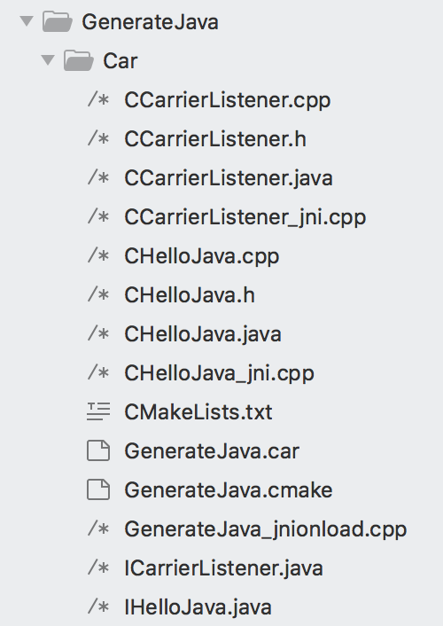
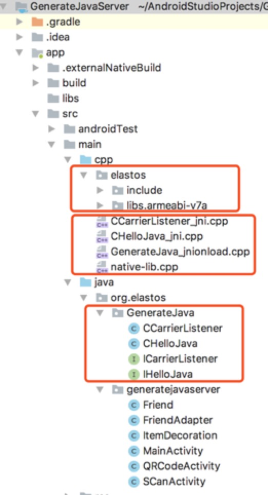

# Car for Java Developer

> ## 1.简介

    Car的开发语言是C++，为了方便Java开发者，我们实现了代码生成工具，支持通过java来实现car构件。java和c之间的相互调用通过jni和java反射来完成，并且全部自动生成相关代码，开发者只需拷贝相关文件和依赖到android工程，并添加java类的实现即可。
    
    这样实现的构件同样支持RPC(远程调用)，本文档通过具体实例来讲解如何使用。

    C++实现远程调用的示例请参考
[How to Call A Remote Car Component](../How_To_Call_A_Remote_CAR_Component)

> ## 2.How

    以下内容以Elastos.RT/Sources/Sample/GenerateJava为例。

> ### 2.1.定义接口

如何编写car构件请参考：
[Car Programming](../How_To_Write_A_Car_Component)

编写一个car构件，内容如下：
module
{
    importlib("Elastos.CoreLibrary");

    interface IHelloJava {
        Hello(
            [out] String* hello);
    }

    class CHelloJava {
        interface IHelloJava;
    }

    class CCarrierListener {
        interface ICarrierListener;
    }
}

这里定义了一个接口IHelloJava，一个class CHelloJava实现IHelloJava。CCarrierListener实现了一个系统接口ICarrierListener。

car文件的名称即是模块名称，生成的so和导出头文件都以模块名称命名。如示例中的GenerateJava.car，GenerateJava是模块名称，导出头文件GenerateJava.h，生成libGenerateJava.so。

> ### 2.2.生成代码

    在car文件所在目录执行 emake GenerateJava.car java，生成代码



    对应每一个car interface都会生成一个对应的Java interface，如示例中的IHelloJava.java, ICarrierListener.java。

    对应每一个car class都会生成一个对应的java class，实现相应的java interface。如示例中的CHelloJava.java, CCarrierListener.java。java class是我们真正需要实现的class。
    生成java文件的包名是org.elastos.modulename。

    CHelloJava.cpp/h, CCarrierListener.cpp/h是car class的定义和实现，所有的接口方法都会直接调用对应java class的方法。

    对应每一个car class还会生成一个jni cpp，创建java对象时会同时创建一个car对象，相互保存。如示例中的CHelloJava_jni.cpp, CCarrierListener_jni.cpp。

    每一个模块会生成一个jni onload的cpp，用于注册所有class相关的native方法。如示例中的GenerateJava_jnionload.cpp。

> ### 2.3.编译和导出

    首先编译Elastos.RT仓库，如何编译请参考：
[Getting Started](../getting_started)

    修改模块上层目录的CMakeLists.txt, 添加模块目录名称到编译树种，例如示例代码添加如下内容：
    xdk_add_subdirectories(
        GenerateJava
    )
  
    切换到模块目录，执行emake，编译模块。
  
    编译成功之后，执行dropsdk -s armeabi-v7a，导出头文件和so。导出内容在Elastos.RT/SDK/android下。

    执行exporteco -m GenerateJava -s armeabi-v7a，导出模块头文件和so。导出目录同dropsdk。这个指令必须在模块目录下执行，如示例中需在Elastos.RT/Sources/Sample/GenerateJava/Car目录下执行。

> ### 2.4.创建android工程

    创建两个android工程，GenrateJavaServer，GenerateJavaClient，勾选include c++ support。

> ### 2.5.拷贝文件android工程



    将Elastos.RT/SDK/android下的elastos目录拷贝到工程中，如示例工程拷贝到src/main/cpp目录下。

    生成的jni相关cpp文件拷贝到工程的jni相关目录，如示例工程拷贝CCarrierListener_jni.cpp, CHelloJava_jni.cpp, GenerateJava_jnionload.cpp到src/main/cpp目录。

    生成的java文件拷贝到工程对应包名目录下，如示例工程拷贝CCarrierListener.java, CHelloJava.java, ICarrierListener.java, IHelloJava.java到src/main/java/org/elastos/GenerateJava目录下。

> ### 2.6.设置android工程编译相关参数

    修改app/build.gradle，设置cppFlags，编译支持的目标cpu

``` 
    externalNativeBuild {
        cmake {
            cppFlags "-std=c++11", "-D_GNUC", "-D_linux", "-D_UNDEFDLLEXP", "-fvisibility=hidden"
        }
    }
    ndk {
        abiFilters 'armeabi-v7a'
    }
``` 

    配置jni libs目录

``` 
    sourceSets {
      main {
        jniLibs.srcDirs = ['src/main/cpp/elastos/libs']
      }
    }
``` 

    修改app/CMakeLists.txt，增加新添加的cpp文件和头文件目录，链接目录，链接依赖的so

``` 
    include_directories(src/main/cpp/elastos/include)
    link_directories(src/main/cpp/elastos/libs/${ANDROID_ABI})

    add_library( # Sets the name of the library.
                native-lib

                # Sets the library as a shared library.
                SHARED

                # Provides a relative path to your source file(s).
                src/main/cpp/native-lib.cpp
                src/main/cpp/GenerateJava_jnionload.cpp
                src/main/cpp/CCarrierListener_jni.cpp
                src/main/cpp/CHelloJava_jni.cpp)

    target_link_libraries( # Specifies the target library.
                          native-lib

                          # Links the target library to the log library
                          # included in the NDK.
                          ${log-lib}
                          Elastos.Runtime
                          Elastos.Runtime_static
                          Elastos.CoreLibrary
                          elasession)
``` 

> ### 2.7.添加Java class的实现

    以CHelloJava.java为例，说明实现内容需要注意的地方。

``` java

package org.elastos.GenerateJava;

//this java class will implement the elastos interface.
public class CHelloJava implements IHelloJava {
    static {
        System.loadLibrary("Elastos.Runtime");
        System.loadLibrary("Elastos.CoreLibrary");
        System.loadLibrary("GenerateJava");
        //TODO : Your jni so, please fill it.
        System.loadLibrary("Your_Jni");
    }

    private long mCarObj = 0;

    private native long native_CHelloJava();
    private native void native_CHelloJava_Destroy(long carobj);

    public CHelloJava() {
        mCarObj = native_CHelloJava();
        //TODO: Add your code here
    }

    public long getCarObject() {
        return mCarObj;
    }

    // invoke destroy to release car object
    public void destroy() {
        native_CHelloJava_Destroy(mCarObj);
    }


    public String Hello() {
        //TODO: Add your code here
        return "NULL";
    }


}
```

    System.loadLibrary("Your_Jni");需要填入android工程里生成的jni lib的名称。如示例工程中名为native-lib，那么修改为System.loadLibrary("native-lib");。
    这部分可以移动到其他java class里，但要保证这些so都有加载。如示例工程移动到了MainActivity中。

    native_CHelloJava和native_CHelloJava_Destroy是关联对应c对象的部分，这部分不可以改动。
    自动生成了一个与C对应的java class的构造函数，可以在构造函数里添加自己的实现。如果要增加构造函数，请保证一定要调用native_CHelloJava并且给mCarObj赋值。mCarObj保存的是与java对象关联的c对象的地址。

    生成的destroy方法是用来释放c对象的，如果java对象不再使用了，必须要调用destroy方法来释放c对象。

    destroy方法之后就是待实现的接口方法，自行添加实现内容。如示例中的Hello()，返回Hello From Java的字符串。
    
> ### 2.8.实现添加好友，注册和获取服务进行远程调用

    这部分内容请参考如何使用car的远程调用功能文档：
[How to call a remote Car component](../How_To_Call_A_Remote_CAR_Component###2.3.在android应用中调用)

    与上述文档中有区别的地方是，CCarrierListener是在java端实现，而非jni的cpp中。对应调整注册listener时的方法，要从java class中获取到c对象。

``` cpp
extern "C" JNIEXPORT void JNICALL Java_org_elastos_generatejavaserver_MainActivity_startCarrier(
        JNIEnv *env,
        jobject jobj,
        jstring path,
        jobject jlistener) {

    ECode ec = (ECode) _CCarrier_GetInstance(&gCarrier);
    if (FAILED(ec)) return;

    jclass _clazz = env->GetObjectClass(jlistener);
    jmethodID _methodId = env->GetMethodID(_clazz, "getCarObject", "()J");
    jlong _carobj = env->CallLongMethod(jlistener, _methodId);

    gCarrier->AddCarrierNodeListener(ICarrierListener::Probe((IInterface*)_carobj));

    const char* nativeString = env->GetStringUTFChars(path, nullptr);
    gCarrier->Start(String(nativeString));
    env->ReleaseStringUTFChars(path, nativeString);
}
```

    参考示例工程Elastos.RT/Sources/Sample/GenerateJava/GenerateJavaServer。

> ## 3.总结

    通过生成java代码的工具，可以很大的简化java开发者使用car构件的过程。对系统构件部分，目前还需要手动写jni方法，接下来会继续开发生成工具，系统构件通过命令可以直接生成jni方法，方便在java中调用。到时对java开发者几乎可以不再关注jni和c方法。敬请期待。
